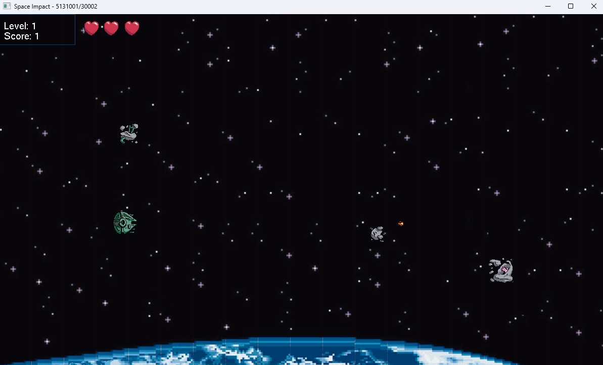

### :white_heart: clowixdev :sparkles: 

<h3 align="center"> Hi there, my name is Nikita ✨ </h3>

---

### About me :book:

Nice to meet you through the screen, I am **19** years old Russian programmer and I am a second course student of **IC** faculty in **SPBPU**. Can read docs in **ENG** and speak kind of freely, despite my home country.

&nbsp;&nbsp;

&nbsp;&nbsp;
<!---

&nbsp;&nbsp;

--->

---

### Tools :hammer:

  
  

---

### Projects :shell:

To this moment, I made 3 projects that matter to me:

 

<h4 style="display: inline;">&#127756; RRClan Helper bot</h4>

<h5 style="display: inline;">About project&nbsp;&nbsp;&nbsp;</h5><a href="https://github.com/clowixdev/samus_bot">&#128279; repo (private)</a> 

**Rush Royale Clan Helper (RRCH bot &#129302;)** is created to help clan leaders and officers in communication with clan members. Using this bot, you can create **message templates&#128211;** and send them as you need to all clan members. Also, you can **mention &#128226;** everyone in your Telegram chat with only one command, or you can mention specific player **groups &#128101;** (who can clear fraction fields in **Dragon Event &#128009;**). All this information is stored in clan member's **profile &#129706;** where you can find any desired information.

 

 

<h4 style="display: inline;">&#127754; Shipment Management Service</h4>

<h5 style="display: inline;">About project&nbsp;&nbsp;&nbsp;</h5><a href="https://github.com/clowixdev/sms">&#128279; repo (public)</a> 

**Shipment management system (SMS &#128666;)** is a service that is created to help drivers exclude **paper documents &#128203;** which can be damaged or lost. Manager create shipment in service, **QR-code &#128242;** is being sent to driver and this QR-code contains all needed information and documents in **secured &#128272;** digital format. After shipment is received by endpoint, they can **"Accept shipment &#128260;"** and change shipment status to **"Delivered &#9989;".**

 

 

<h4 style="display: inline;">&#127747; Space Impact game</h4>

<h5 style="display: inline;">About project&nbsp;&nbsp;&nbsp;</h5><a href="https://github.com/clowixdev/ds_coursework">&#128279; repo (public)</a> 

This is a copy of old mobile game **Space Impact &#128126;** with our own ideas for some game mechanics. All the development was conducted in **C &#10024;** language with **OpenGL &#127754;**, especially using **freeglut** &#128065;. To load textures, we used **STB_IMAGE** &#9999; library that we found in the Ithernet.

---

### Stats :bar_chart:

&nbsp;&nbsp;&nbsp;&nbsp; 

---

<!---

### Pinned :stars:

&nbsp;&nbsp;&nbsp;&nbsp;&nbsp;&nbsp;

&nbsp;&nbsp;&nbsp;&nbsp;&nbsp;&nbsp;

&nbsp;&nbsp;&nbsp;&nbsp;&nbsp;&nbsp;

---

--->

### Helpful Links (readme styling) :city_sunset:

#### [:cactus: Stats section](https://github.com/anuraghazra/github-readme-stats)
#### [:panda_face: Tools icons](https://github.com/tandpfun/skill-icons)
#### [:bulb: Badges](https://github.com/antistereotip/Badges-for-GitHub)
#### [:gem: MD Emoji](https://github.com/markdown-templates/markdown-emojis)
